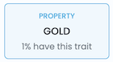
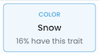
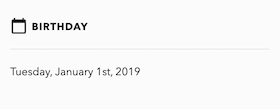
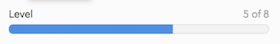
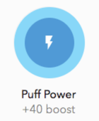
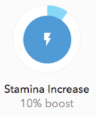

# Magia - The NFT Generator -


Magiaは究極のカスタマイズ性と処理速度を誇るプロのためのNFTジェネレーター。


## インストール


Makefile

```shell
make install
```


Mint🌱

```shell
mint install GeneralD/Magia
```


## 機能


主にNFTの生成に関して次の機能を提供する。

- 無数のレイヤーを合成する
  - 各レイヤーはアニメーションさせることができる
  - 各レイヤーのパーツごとの抽選の当選率を設定する
  - 各レイヤー内のパーツの抽選順序とレイヤーの重ね順を個別に指定できる
  - パーツ同士の組み合わせの可否をレイヤーを跨いでルールづけできる
- GIFもしくはPNG画像ファイルを出力する
  - テスト目的のウォータードロップ付きの画像を出力できる
  - トークンID（連番）を任意のフォントで印字できる
- OpenSeaのMetadata Standardに準拠したメタデータファイルを出力できる
  - 使用されたパーツごとにTraitを持たせられる
  - Traitの順序を指定できる（マーケットプレース内での表示に反映されるとは限らない）
- その他
  - ERC721AなどでどうしてもURIが連番になりがちなときの先読み防止策の提供
  - 読み込むアセットフォルダー内の重複する不要なファイルを掃除する


## アセットの準備


### スタート

入力する素材画像群を準備しよう。

まずはフォルダを1つ作る。（以後これをアセットフォルダと呼ぶ）

その中にフォルダを必要なレイヤーの数だけ作る。（以後、これらをレイヤーフォルダと呼ぶ）

例えば、頭、体、脚を組み合わせて作るNFTならレイヤーは4つではないだろうか。おそらく背景も必要だから。

実際は帽子を被っていたり、アイテムを持っていたりするから現実的には10個くらいになると思う。

各フォルダーには分かりやすい名前を付けておこう。


### 中身の準備

#### 静止画像を作る場合 (GIF / PNG)

各レイヤーフォルダ内にパーツを配置しよう。

たとえば、`head`というレイヤーフォルダに頭のパーツをたくさん入れておく。

この時、画像は背景透過を使うことになることが殆どなのでPNG形式などで準備しておく。背景画像など透過部分がない場合はこの限りではない。

同様に`body`や`item`など他のレイヤーフォルダの中にも画像を入れていこう。


#### 動く画像を作る場合（Animated GIF / Animated PNG）

各レイヤーフォルダ内に更にフォルダを配置しよう。これはレイヤーごとの必要なパーツの数だけ作っていくことになる。

たとえば、`item`というレイヤーフォルダに`energy_drink`や`cigarettes`のようなフォルダを作る。（以後、それらをパーツフォルダと呼ぶ）

そして各パーツフォルダに画像を入れていく。

ここで複数枚の画像を入れた場合、そのレイヤーはそれらの画像をフレームとするアニメーションレイヤーとなる。（以後、それらをフレーム画像と呼ぶ）

しかし、すべてのレイヤーに均等な枚数の画像を入れる必要はない。アニメーションしなくて良いレイヤーはパーツフォルダの中に一枚だけ入れておけば良い。

仕組みを説明すると、最終的に各レイヤーフォルダから1つずつ抽選で選ばれたパーツフォルダの中から、最も画像の枚数が多いものが、出力される画像のフレーム数となる。

なので、フレーム数が24となる場合、フレーム画像が1枚しかないパーツはその1枚を24フレーム繰り返すので静止部分となる。


## 画像生成実行


基本的な使い方

```shell
magia summon [アセットフォルダ] -o [出力先]
```


オプション

- `-d` , `--anim-duration`
  - 出力する画像がアニメーションする場合の秒数
  - デフォルトは `2.0` 秒

- `-k` , `--hashed-name`
  - `true` なら `keccak256` でハッシュ化した名前をファイル名に使う
  - デフォルトは `false`
  - `--name-format` と組み合わせて使うとミント前のトークン先読み防止に効果的

- `-h` , `--help`
  - ヘルプを表示
- `--image-foldername`
  - 画像を格納するフォルダの名前
  - デフォルトは `images`
  - メタデータの `image` のパスでも使用される

- `--name-format`
  - ファイル名のフォーマットを指定できる
  - 書式指定文字列が利用可
  - デフォルトは%dで `tokenId` がそのまま使用される
  - 拡張子は含めない
- `-o` , `--output-dir`
  - 出力先のパス
  - 適当に空きフォルダを作って指定しておけば問題ない
  - デフォルトは `~/Documents/NFTs/{アセットフォルダ名})`
- `-f` , `--overwrite`
  - 再生成する場合に上書きするかどうか
  - デフォルトは `false`
- `-q` , `--quantity`
  - いくつ生成するか
  - デフォルトは `100`
- `-r` , `--reprint`
  - 過去の生成時に出力された `data.sqlite` のパスを指定すれば、抽選せず同じ出力を再現する。
  - これから生成しようとする画像に関して`tokenId` で比較し再現する。
  - ただし設定ファイルや入力画像に変更があれば同じ結果を保証できない。
  - 設定ファイルを含むアセットフォルダに、リリース用成果物を生成時に出力された `data.sqlite` を含めて保管すると、生成された画像そのものを保存しておかなくても必要に応じて再生することができる
    - `git` 管理時に便利
  - アセットフォルダ内に変更を加えた後でも再生成できるので、一部のNFTを修正したい場合などオフチェーンのNFTなら手直しが楽
- `--sample`
  - 画像にサンプル画像用のウォータードロップを入れるかどうか
  - デフォルトは `false`
  - テストネットでのテスト用などにどうぞ
- ` -s` , `--start-index`
  - 生成開始する `tokenId`
  - デフォルトは `1`
- `-t` , `--type`
  - 生成する画像のフォーマット
  - デフォルトは `gif`
  - `gif` , `png` が指定可能
- `--without-image`
  - 画像は生成しない
  - デフォルトは `false`
- `--without-metadata`
  - メタデータは生成しない
  - デフォルトは `false`


### ミント前トークンの先読み防止

```shell
magia summon [アセットフォルダ] -o [出力先] -k --name-format "Magia%d"
```

とすると生成されるファイル名は暗号化され、サーバーに配置した際のURLの先読みを困難にさせる。

例えば、上の例ならトークンIDが1のとき、 `Magia1` を `keccak256` で暗号化した名前を用いる。この例ならメタデータのファイル名は `738261d87963911ed66c49e58b809371981909ffd660146be8a5576daedc7d91.json` となる。合わせて画像のファイル名も決定される。


生成したファイル名を `solidity` 側で適切な `tokenURI` を組み立てるコード。

（`ERC721` を例にしているので `ERC1155` や `Upgradeable` に対応している場合は適切にアレンジすること。）

```solidity
using Strings for uint256;

string private _keccakPrefix;

function setKeccakPrefix(string memory prefix) external onlyOwner {
    _keccakPrefix = prefix;
}

function tokenURI(uint256 tokenId)
    public
    view
    virtual
    override
    checkTokenIdExists(tokenId)
    returns (string memory)
{
    bytes32 keccak = keccak256(abi.encodePacked(_keccakPrefix, tokenId.toString()));
    return string(abi.encodePacked(_baseURI(), _toLower(_toHex(keccak)), ".json"));
}

modifier checkTokenIdExists(uint256 tokenId) {
    require(_exists(tokenId), "tokenId not exist");
    _;
}

function _toHex(bytes32 data) private pure returns (string memory) {
    return string(abi.encodePacked(_toHex16(bytes16(data)), _toHex16(bytes16(data << 128))));
}

function _toHex16(bytes16 data) private pure returns (bytes32 result) {
    result =
        (bytes32(data) & 0xFFFFFFFFFFFFFFFF000000000000000000000000000000000000000000000000) |
        ((bytes32(data) & 0x0000000000000000FFFFFFFFFFFFFFFF00000000000000000000000000000000) >> 64);
    result =
        (result & 0xFFFFFFFF000000000000000000000000FFFFFFFF000000000000000000000000) |
        ((result & 0x00000000FFFFFFFF000000000000000000000000FFFFFFFF0000000000000000) >> 32);
    result =
        (result & 0xFFFF000000000000FFFF000000000000FFFF000000000000FFFF000000000000) |
        ((result & 0x0000FFFF000000000000FFFF000000000000FFFF000000000000FFFF00000000) >> 16);
    result =
        (result & 0xFF000000FF000000FF000000FF000000FF000000FF000000FF000000FF000000) |
        ((result & 0x00FF000000FF000000FF000000FF000000FF000000FF000000FF000000FF0000) >> 8);
    result =
        ((result & 0xF000F000F000F000F000F000F000F000F000F000F000F000F000F000F000F000) >> 4) |
        ((result & 0x0F000F000F000F000F000F000F000F000F000F000F000F000F000F000F000F00) >> 8);
    result = bytes32(
        0x3030303030303030303030303030303030303030303030303030303030303030 +
            uint256(result) +
            (((uint256(result) + 0x0606060606060606060606060606060606060606060606060606060606060606) >> 4) &
                0x0F0F0F0F0F0F0F0F0F0F0F0F0F0F0F0F0F0F0F0F0F0F0F0F0F0F0F0F0F0F0F0F) *
            7
    );
}

function _toLower(string memory str) private pure returns (string memory) {
    bytes memory b = bytes(str);
    bytes memory l = new bytes(b.length);
    for (uint256 i = 0; i < b.length; i++)
        l[i] = (uint8(b[i]) >= 65) && (uint8(b[i]) <= 90) ? bytes1(uint8(b[i]) + 32) : b[i];
    return string(l);
}
```

`_keccakPrefix` を `private` にすることで、ファイル名を少しでも予測しにくくしている。

ファイル名は予測しにくいが、トークンごとに1つずつコントラクトに記憶させる方式ではないので、ガス代が嵩むこともなく `ERC721A` や `ERC721AUpgradeable` などとも相性が良い。


上記の例の場合、 `setKeccakPrefix("Magia")` を呼び出すことで設定すれば良いが、Etherscanなどでトランザクションを見れば `_keccakPrefix` の値を調べることはできてしまう。しかし、その値を踏まえた上で最終的に決定される `tokenURI` を導き出せるユーザーは一般的には多くないはず。


#### ERC721Aとの両立

`ERC721A` では `baseURI` と `tokenId` を単純に連結したものを `tokenURI` として返却するのがデフォルト実装になっているが、実装をoverrideすれば良い。連番をもとに暗号化された `tokenURI` を生成するので `ERC721A` と合わせると、コストパフォーマンスと先読み防止を両立できる。


#### 発展的な使い方

以下はReveal（リビール）を扱う場合のコード。

```solidity
bool public isRevealed;

event Revealed(bool state);

function setIsRevealed(bool state) external onlyOwner {
    isRevealed = state;
    emit Revealed(state);
}

function tokenURI(uint256 tokenId)
    public
    view
    virtual
    override
    checkTokenIdExists(tokenId)
    returns (string memory)
{
    return isRevealed ? _tokenURIAfterReveal(tokenId) : _tokenURIBeforeReveal();
}

function _tokenURIAfterReveal(uint256 tokenId) private view returns (string memory) {
    bytes32 keccak = keccak256(abi.encodePacked(_keccakPrefix, tokenId.toString()));
    return string(abi.encodePacked(_baseURI(), _toLower(_toHex(keccak)), ".json"));
}

function _tokenURIBeforeReveal() private view returns (string memory) {
    return string(abi.encodePacked(_baseURI(), "seed.json"));
}
```

リビール前は同一の `tokenURI` を全てのトークンIDに対して返却する。

リビール後は暗号化された `tokenURI` をそれぞれ返却する。

このケースなら、ミントが完了するまで `setKeccakPrefix` を実行しなければ、サーバーにファイルの配置が完了していても先読みした上でミントされるようなことは絶対にない。（`_keccakPrefix` に渡す値が人為的に流出していなければ）


## 設定ファイルの書き方


ジェネラティブNFTの生成に於いて、大抵の場合全てのパーツを網羅的かつ完全なランダムに組み合わせるということはないはず。

出現率の偏りや組み合わせの制限など、いくつも制約を設けたくなるだろう。

まずは、 `config.yml` をアセットフォルダ内に配置しよう。

もしくは `config.json` でも良い。JSONフォーマットもサポートしているが、YAMLの方が短く簡潔に書けるので推奨。以下、YAMLで説明を進める。


## tokenIdを印字する


`tokenId` を画像に印字したい場合があるはず。

その場合は以下のような設定を追記する。

```yaml
drawSerial:
  enabled: true
  color: "000000"
  font: M+ 1p black
  format: "#%05d"
  offsetX: 40
  offsetY: 14.5
  size: 38
```

- `drawSerial` に定義する。
  - `enabled` は `true` で良い。
    - デフォルトは `true`。
    - 一時的に印字をさせたくない場合は `false` にすれば切り替えられる。
  - `color` はHTMLカラーコードで指定できる。ただし `#` は無くても可。
    - デフォルトは `000000`。
  - `font` はmacOSのシステムに認識されているフォント（Libray/Fonts以下配置）なら全て指定することができる。
    - アセットフォルダ直下に置かれたフォントも指定することができる。
  - `format` はシリアルナンバー（整数値）を印字する際のフォーマットを指定する。
    - 書式指定文字列が利用可
      - 例えば`#%05d` なら `123` は `#00123` となる。
    - デフォルトは`%03d`。
  - `offsetX` は画像左からの印字位置までの距離。
    - デフォルトは`0`。
  - `offsetY` は画像下からの印字位置までの距離。
    - デフォルトは`0`。
  - `size` はフォントのサイズ。
    - デフォルトは`14`。


## 各パーツの当選確率（レア度）の調整


各レイヤーのパーツごとの当選確率を設定する。ただし確率は重み（`weight`）の比重によって行う。全パーツの重みの初期値は`1`。正規表現で指定した名前に適合するパーツに対しては重みが掛け合わされていく。


`divideByMatches` によって`weight` をマッチした数で割ることもできる。

例えば、赤いニット帽、青いニット帽、黄色のニット帽、黒いヘルメット、白いヘルメットの中から1つを抽選する場合を考える。

ニット帽が出る確率を70%、ヘルメットが出る確率を30%としたいとする。

`weight` は重み、つまり比率を表すのでニット帽は0.7、ヘルメットは0.3と設定すれば良い。（7と3でも構わない）

しかしこうすると各ニット帽が0.7なので、いずれかのニット帽が出る比率は2.1。同様に計算するとヘルメットは0.6となる。この時、ニット帽が出る確率は 2.1 / (2.1 + 0.6) = 0.7777... となるので、およそ78%となってしまう。

そこで、`divideByMatches` を`true` にするとこの問題を簡単に解決できる。

`true` のとき、正規表現でニット帽にマッチするものが3つ場合、`weight` の値は3で割られる。ヘルメットなら2で割る。

こうすると、ニットの重みの合計は0.7となる。ヘルメットの合計は0.3。したがって、いずれかのニット帽が出る確率は 0.7 / (0.7 + 0.3) = 0.7 (70%) となる。

余談だが、この時の赤いニット帽が出る確率は0.7 / 3 = 0.2333... で黒いヘルメットが出る確率は 0.3 / 2 = 0.15 となるが、`divideByMatches` を `true` にすることでこのような煩雑な計算を意識しなくても良いことになる。


```yaml
randomization:
  probabilities:
  - target:
      layer: cap
      name: "^.*_knit$"
    weight: 0.7
    divideByMatches: true
  - target:
      layer: cap
      name: "^.*_hardhat$"
    weight: 0.3
    divideByMatches: true
```

- `randomization` に定義する。
  - `probabilities` はパーツの当選確率についての定義を配列に列挙する。
    - `target` は当選確率を設定する対象。
      - `layer` はパーツが属するレイヤーフォルダ。
      - `name` は対象をマッチさせる正規表現。

    - `weight` は重み。
      - デフォルトは`1`

    - `divideByMatches` は`weight` をマッチした数で割ったものを用いるかどうか。
      - デフォルトは`false`


## パーツの組み合わせの制約


あらゆる組み合わせが存在するからこそジェネラティブは面白くなるものだが、中には厳格な組み合わせの制限を設けたいこともあるだろう。

あくまで例えばの話だが、鷹に耳やツノを付けたくない場合もある。

ヘルメットを突き破ってツノが生えるのが嫌な場合もあるだろう。


動物のNFTを作っているケースを考えよう。

胴体の抽選でキリンの胴体が出たとする。その後、服や帽子、目の抽選が行われるとする。

まず服に関して、首が長いキリンはパーカーのフードを被るデザインには的確では無い。この場合は正規表現の否定を用いるなどして対象を除外する。

また、このキリンというキャラクターは少しおちゃめで、顔が画像に収まっていないという趣向のものだとした場合、目や帽子は描画する必要がないので（そもそも他の動物と共用パーツだと描画位置がおかしくなる）`name` を空欄にすることで、そのパーツの抽選をスキップさせることが出来る。


ちなみに前述の「当選確率」との兼ね合いは、組み合わせの制約によって抽選対象に残ったものだけで `weight` を用いた計算が行われる。

```yaml
combinations:
- target:
    layer: body
    name: "^(?=.*_giraffe_).*$"
  dependencies:
  - layer: cloth
    name: "[^hoody]"
  - layer: eye
    name:
  - layer: cap
    name:
```

- `combinations` に定義する。
  - `target` はルールを設定する対象。
    - `layer` は対象のレイヤー。
    - `name` はパーツをマッチさせる正規表現。
  - `dependencies` は組み合わせの制限を定義する。
    - `layer` は制限する対象のレイヤー。
    - `name` は抽選対象に残したいパーツ全てをマッチさせる正規表現。
      - よくある使い方は以下。
        - その対象が対応しないパーツのみを否定する正規表現。
        - その対象は他と対応できる組み合わせが排他的に異なるので、専用に用意された対象を網羅する正規表現。


## レイヤーの重ね順と抽選順


この設定がなければレイヤーの重ね順と抽選順はレイヤーフォルダ名で辞書順となる。

設定なしでレイヤーフォルダ名だけで解決する場合は先頭に番号を付けると明瞭だ。

それでもやはり色々なバリエーションの画像を作ろうと試していると入れ替えは頻繁に発生するので設定を書いてしまおう。

パーツの組み合わせの依存関係の兼ね合いで抽選順の設定が必要なこともある。

例えば、`03_hand` のパーツが `04_item` のパーツに制約を与える場合、`03_hand` が先に抽選される必要がある。

もちろんレイヤーの重ね順と抽選順が同じになるとは限らないので、設定は分けられている。

```yaml
order:
  layerDepth:
  - background
  - body
  - hand
  - handheld
  - hair
  - facegear
  - headgear
  - eye
  - cloth
  - ear
  selection:
  - background
  - body
  - hand
  - handheld
  - cloth
  - hair
  - facegear
  - headgear
  - eye
  - ear
```

- `order` に定義する。
  - `layerDepth`はレイヤーの重ね順を配列に列挙する。

  - `selection`は抽選順を配列に列挙する。


## メタデータ生成


OpenSeaの[Metadata Standard](https://docs.opensea.io/docs/metadata-standards)に準拠したメタデータファイルも併せて出力される。

```yaml
metadata:
  backgroundColor: f7cc1b
  descriptionFormat: "First collections generated by MAGIA.  \nSerial number is %05d."
  nameFormat: MAGIA NFT #%05d
  externalUrlFormat: https://magianft.com/
  baseUrl: https://nagianft.com/assets/
  traitOrder:
  - Family
  - Fortune
  - Intelligence
  - Talent
  data:
  - conditions:
    - layer: 02_body
      name: "^(?=.*_cat_).*$"
    traits:
    - type: label
      trait: Family
      value: Cat
    - type: rankedNumber
      trait: Fortune
      value: 42
    - type: rankedNumber
      trait: Intelligence
      value: 39
    - type: rankedNumber
      trait: Talent
      value: 37
```

- `metadata` に定義する。
  - `backgroundColor` はHTMLカラーコードで指定できる。ただし `#` は付けない。
    - マーケットプレースのNFT画像周囲の余白などの色として使われることがある。
  - `descriptionFormat` はメタデータの `description` の文言を定義する。
    - `tokenId` を埋め込みたい場合は文中に書式指定文字列を埋め込むと良い。
    - ${ `trait` }を埋め込むと`value` に置換される。
      - 上の例なら${Family}はCatに置換される。
    - Markdownがサポートされている。
      - スペース2つ + `\n` で改行を表す。
      - `\n\n` で空行が入る。
  - `nameFormat` はメタデータの `name` を定義する。
    - `tokenId` を埋め込みたい場合は文中に書式指定文字列を埋め込むと良い。
    - ${ `trait` }を埋め込むと`value` に置換される。
  - `externalUrlFormat` はメタデータの `urlFormat` を定義する。
    - `tokenId` を埋め込みたい場合は文中に書式指定文字列を埋め込むと良い。
    - ${ `trait` }を埋め込むと`value` に置換される。
  - `baseUrl` はメタデータの `image` を定義するのに用いられる。
    - コントラクトで `baseURI` を扱っている場合はそれを指定する。
  - `traitOrder` はメタデータの `traits` 配列内の並び順を指定する。
    - 指定しなくても構わないが、指定する場合は網羅されていなければエラーとなる。
  - `data`
    - `conditions` はトレートを付与したい対象を定義する。
      - `layer` はトレートを付与する条件判定を行うレイヤーを指定する。
      - `name` は正規表現でパーツ名を表現し、マッチすれば条件に適合したとみなす。
    - `traits` は付与するトレートを配列で列挙する。
      - 基本的にトレートは `trait` をキーとし `value` を値とするキーバリューペア。
      - `type` にトレートのタイプを以下のいずれかから指定する。
        - `simple` に限り `trait` を指定する必要がない。
        -  `value` のみを文字列で指定する。
          - 属性のタイトルがない、値だけのトレート。
          - `value` のみを文字列で指定する必要がある。
        - `label` は標準的なトレート。
          -   `trait` を文字列で、 `value` を文字列か数値または日時で指定する。
              -   日時を指定する場合はUNIX秒を用いる。例：1668757000
        - `rankedNumber` は値が数値となるトレートで、OpenSea上ではその数値自体に加えて、その数値がトークン全体の中で何番目に大きいのかも表示される。
          - `trait` を文字列で `value` を数値で指定する必要がある。
        - `boostNumber` は値が数値となるトレートで、OpenSea上ではその数値自体に加えて、その数値が最大値付きの円グラフで表示される。
          - `trait` を文字列で `value` と`max` を数値で指定する必要がある。
        - `boostPercentage` は値が0から100の間の数値となるトレートで、OpenSea上ではその数値自体に加えて、その数値が100を最大とした円グラフで表示される。
          - `trait` を文字列で `value` を0から100の間の数値で指定する必要がある。
        - `rarityPercentage` は `boostPercentage` の1種でこのプログラムがパーツの抽選を行った際の当選確率を円グラフで表示する。
          - `trait` のみを文字列で指定する。
          - 指定している `layer` 中で当選したパーツが候補全体の中で何%の確率で選ばれたのかが円グラフで表示される。
            - `combinations` の設定で候補から除外されたパーツは確率計算から外れる。
      - `trait` はトレートのタイトルとなる文字列。
      - `value` はトレートの値となる文字列。
        - 数値の場合は整数値でも小数値でも良い。
        - 少数の桁はそのままメタデータ生成時に反映される。
      - `max` は `boostNumber` のみ指定。


| type             | trait  | value                          | max  | OpenSea上の表示サンプル                            |
| ---------------- | ------ | ------------------------------ | ---- | -------------------------------------------------- |
| simple           | -      | 文字列                         | -    |                        |
| label            | 文字列 | 文字列 \| 数値 \| 日付(UNIX秒) | -    |  |
| rankedNumber     | 文字列 | 数値                           | -    |            |
| boostNumber      | 文字列 | 数値                           | 数値 |              |
| boostPercentage  | 文字列 | 数値                           | -    |      |
| rarityPercentage | 文字列 | -                              | -    |                                                    |


---


## 実績


このジェネレーターで召喚したNFTプロジェクト


[ANIM.JP](https://opensea.io/collection/anim-jp)


## ライセンス


自己の責任でご自由にご利用ください🙏

また、~~召喚したNFTプロジェクトの売上の10％~~ お気持ちだけ投げ銭とかWelcomeです。実績欄に掲載させていただけても嬉しいです👑

投げ銭は`0x222222222C769bEcDdb7829B763e9F31F06B2d42` まで☕️

