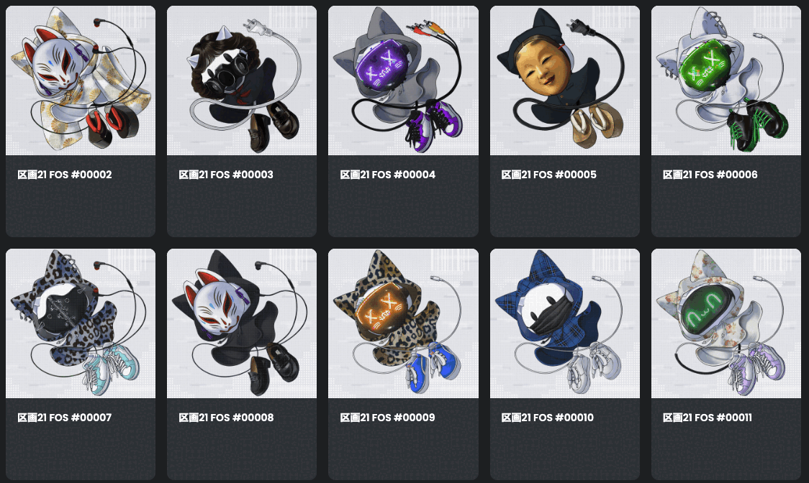
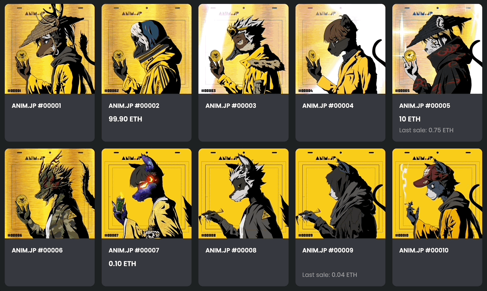

# Magia - The NFT Generator -


Magiaは究極のカスタマイズ性と処理速度を誇るプロのためのNFTジェネレーター。


## 主な機能


主にNFTの生成に関して次の機能を提供する。

- 無数のレイヤーを合成する
  - 各レイヤーはアニメーションさせることができる
  - 各レイヤーのパーツごとの抽選の当選率を設定する
  - 各レイヤー内のパーツの抽選順序とレイヤーの重ね順を個別に指定できる
  - パーツ同士の組み合わせの可否をレイヤーを跨いでルールづけできる
  - 任意のトークンIDに対して制約を追加できる
  - あらかじめ基本レイヤー（必ず使用されるレイヤーでなるべく抽選順位が最初になる）内の抽選配分を一定数確保できる
- GIFもしくはPNG画像ファイルを出力する
  - テスト目的のウォータードロップ付きの画像を出力できる
  - トークンID（連番）を任意のフォントで印字できる
- OpenSeaのMetadata Standardに準拠したメタデータファイルを出力できる
  - 使用されたパーツごとにTraitを持たせられる
  - Traitの順序を指定できる（マーケットプレース内での表示に反映されるとは限らない）
- その他
  - URIがトークンIDを基準とした連番になりがちなときの先読み防止策の提供
  - 読み込むアセットフォルダー内の重複する不要なファイルを掃除する


##  インストール


Homebrew🍺

```shell
brew tap generald/private
brew install magia
```


Makefile🔨

```shell
make install
```


Mint🌱

```shell
mint install GeneralD/Magia
```


## ドキュメント

[Wiki](https://github.com/GeneralD/Magia/wiki)を参照


## 実績


このジェネレーターで召喚したNFTプロジェクトを新着順に紹介

### [FOS - Ancient Alpha](https://opensea.io/collection/fos-ancient-alpha)
- リリース元
  - THE LEGAL
- リリース時期
  - 2023年3月
- 準備数
  - 50 (初回)
  

### [ANIM.JP](https://opensea.io/collection/anim-jp)
- リリース元
  - ANIM.JP (DAO)
- リリース時期
  - 2022年7月
- 準備数
  - 10,000
  


## ライセンス


自己の責任でご自由にご利用ください🙏

実績欄に掲載させていただけるだけでも嬉しいです👑

投げ銭は`0x222222222C769bEcDdb7829B763e9F31F06B2d42` まで☕️
